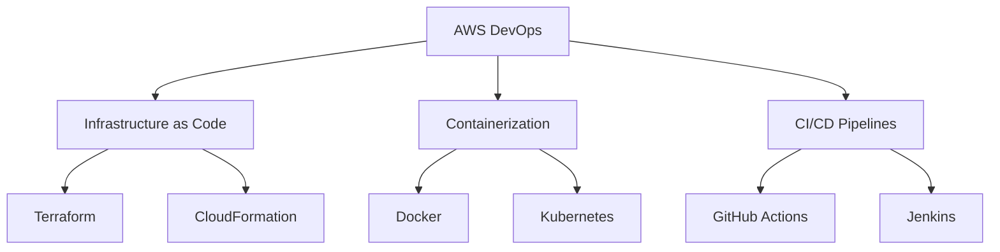

  <h1>
    Hi there, I'm Mayur Wagh! 
    
  </h1>
  
  

## 👨‍💻 About Me

I'm a **DevOps Engineer** with **2+ years** of experience in **AWS cloud infrastructure** and **React development**. I bridge the gap between development and operations, creating efficient, scalable, and automated cloud solutions.

- 🔭 Currently working on **AWS-based CI/CD pipelines and infrastructure automation**
- 🌱 Expanding my knowledge in **Kubernetes, Terraform, and serverless architectures**
- 💬 Ask me about **AWS, DevOps practices, React, or cloud-native applications**
- 🏗️ Building solutions that help teams **deploy faster and with more confidence**
- 🚀 Passionate about **infrastructure as code** and **observability**

## 🛠️ Tech Stack

  
  ### Cloud & DevOps
  
  
  
  
  
  
  
  
  
  
  ### Frontend Development
  
  
  
  
  ### Monitoring & Observability
  
  
  
   

## 🚀 Featured Projects

<table>
  <tr>
    <td align="center">
      <a href="https://github.com/Mayur-wagh4/aws-serverless-app">
        
         
        <b>AWS Serverless App</b>
      </a>
       
      React + Lambda + API Gateway
    </td>
    <td align="center">
      <a href="https://github.com/Mayur-wagh4/terraform-aws-infrastructure">
        
         
        <b>Terraform AWS Infrastructure</b>
      </a>
       
      IaC for multi-environment AWS
    </td>
    <td align="center">
      <a href="https://github.com/Mayur-wagh4/kubernetes-deploy-pipeline">
        
         
        <b>K8s Deploy Pipeline</b>
      </a>
       
      CI/CD for Kubernetes deployments
    </td>
  </tr>
  <tr>
    <td align="center">
      <a href="https://github.com/Mayur-wagh4/react-aws-amplify">
        
         
        <b>React AWS Amplify</b>
      </a>
       
      Full-stack React with AWS backend
    </td>
    <td align="center">
      <a href="https://github.com/Mayur-wagh4/monitoring-stack">
        
         
        <b>Monitoring Stack</b>
      </a>
       
      Prometheus, Grafana & Alertmanager
    </td>
    <td align="center">
      <a href="https://mayurwagh.in">
        
         
        <b>Portfolio Website</b>
      </a>
       
      React + AWS Amplify
    </td>
  </tr>
</table>

## 📈 GitHub Stats

<!--    -->
  

## 🏆 DevOps Achievements

- 🚀 **Reduced deployment time by 70%** through implementation of CI/CD pipelines
- 💰 **Optimized AWS infrastructure costs by 35%** with proper resource scaling
- 🛡️ **Enhanced security posture** by implementing infrastructure as code and security scanning
- 📈 **Improved application reliability** with comprehensive monitoring and alerting
- 🔄 **Streamlined development workflows** by implementing GitOps practices

## 🔍 Current Focus

## 📫 Let's Connect

  
  
  

---

   
  <em>"Every deployment is an opportunity to learn."</em>

